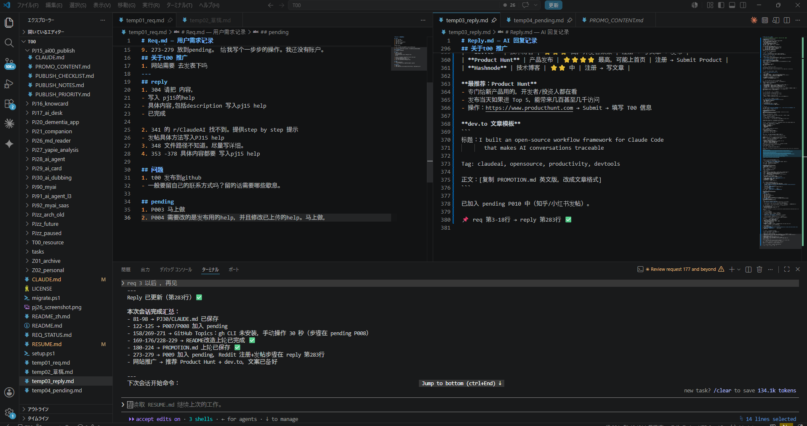

# H38 — 快速开始 / Quick Start

> 从 README.md 移植的核心内容。5分钟入门 AI00 框架。  
> Core content from README.md. Get started with AI00 in 5 minutes.

---

## AI00 解决什么问题

长期与 AI 合作时，最大的痛点是：
**对话越来越长，找不到之前讨论过的内容。**

AI00 用简单的 req→reply 工作流解决这个问题：需求写入固定文件，回答写入固定文件，每条回答都注明来源行号。

---

## 30 秒入门

**第 1 步：在 `temp01_req.md` 写需求**

```
1. 检查登录功能有没有 bug
2. 确认测试覆盖率
```

**第 2 步：告诉 AI 从哪行读**

```
req 1 以后
```

**第 3 步：AI 在 `temp03_reply.md` 整理后回答**

```
══════════════════════════════
❓ [2026-06-10 10:30]
原文：
[1] 检查登录功能有没有 bug
[2] 确认测试覆盖率

AI整理后的问题（mapping 原文）
1. (原文 [1]) 登录 bug 检查
2. (原文 [2]) 测试覆盖率确认
───────────────────────────────
回答

1. 发现 session 过期问题 — 已在 auth.js:42 修复

2. 当前覆盖率 73%，建议优先补充登录模块。

📌 req 第 1-2 行 → reply 第 8 行 ✅
```

**效果**：任何时候，`📌` 标记都能追溯到原始需求行。

---

## 关键触发词

| 说这句话 | AI 执行 |
|---------|---------|
| `req X行以后` | 从第 X 行读 req，回答写入 reply |
| `建项目 xxx` | 自动建文件夹 + 注册到 PROJECTS_INDEX |
| `草稿更新` | 读草稿 → 追加到 req → 回答 → 清空草稿 |
| `再见` | 自动存档 + 更新 RESUME.md |

---

## 特性一览

| 特性 | 说明 |
|------|------|
| 中文优先 | 所有回答输出中文 |
| 行号追踪 | 每条回答注明 req/reply 行号，可溯源 |
| 快速建议模式 | 直接给推荐方案，不啰嗦 |
| 自动存档 | 会话结束自动更新 RESUME.md，下次接着来 |
| Slash 命令 | `/t00-session-end` `/t00-git` `/t00-new-pj` 等 14 个 |
| 多项目管理 | PROJECTS_INDEX 统一管理所有项目 |

---

## 目录结构

```
T00/
├── CLAUDE.md                    ← 根规则（自动加载）
├── AI00_Common/
│   ├── CLAUDE.md                ← 通用规则（含沟通协议）
│   ├── rules/                   ← AI 行为规则（R01–R10）
│   ├── .claude/commands/        ← Slash 命令
│   └── projects/PROJECTS_INDEX.md
├── temp01_req.md                ← 用户写需求
├── temp02_草稿.md               ← 草稿区
├── temp03_reply.md              ← AI 写回答
└── PJxx_项目名/                  ← 各项目文件夹
```

---

📎 相关文档：H02_req_reply_workflow.md — req/reply 完整流程
📎 相关文档：H25_prompt_cheatsheet.md — 所有触发词速查

---

## VSCode 推荐分栏设置

在 VSCode 中，把 `temp01_req.md`（左）和 `temp03_reply.md`（右）并排打开，实现边写边看：



操作：右键 tab → "Open to the Side"，或拖动 tab 到右侧。

---

## English Quick Start

### What AI00 Solves

When working with AI long-term, the biggest pain point is:  
**conversations grow long and previous results get lost.**

AI00 solves this with a simple req→reply workflow: write requests into a file, read answers from a file, every answer tagged with line numbers.

### 30-Second Setup

**Step 1 — Write your request in `temp01_req.md`**

```
1. Check if the login function has any bugs
2. Confirm test coverage
```

**Step 2 — Tell the AI which line to read from**

```
req 1 onwards
```

**Step 3 — AI writes a tracked answer in `temp03_reply.md`**

```
══════════════════════════════
❓ [2026-06-10 10:30]
Original:
[1] Check if the login function has any bugs
[2] Confirm test coverage
───────────────────────────────
1. Found session expiry bug — fixed in auth.js:42

2. Current coverage: 73%. Suggest adding login module tests.

📌 req line 1-2 → reply line 8 ✅
```

Every answer has a `📌` line number tag — **always traceable back to your original request.**

### Key Trigger Phrases

| Say this | AI does |
|---------|---------|
| `req line X onwards` | Read from line X, write answer to reply |
| `new project xxx` | Auto-create project folder + register |
| `draft update` | Read draft → append to req → answer → clear draft |
| `goodbye` | Auto-archive + update RESUME.md for next session |

### Features at a Glance

| Feature | Description |
|---------|-------------|
| Chinese-first | All responses in Chinese (configurable) |
| Line-number tracking | Every answer tagged with req/reply line numbers |
| Quick suggestion mode | Direct recommendation, no back-and-forth |
| Auto-archive | Session-end auto-updates RESUME.md for continuity |
| Slash commands | 14 built-in commands (`/t00-session-end`, `/t00-git`, etc.) |
| Multi-project | PROJECTS_INDEX manages all your projects |

📎 Related: H02_req_reply_workflow.md — Full req/reply workflow  
📎 Related: H25_prompt_cheatsheet.md — All trigger phrases
