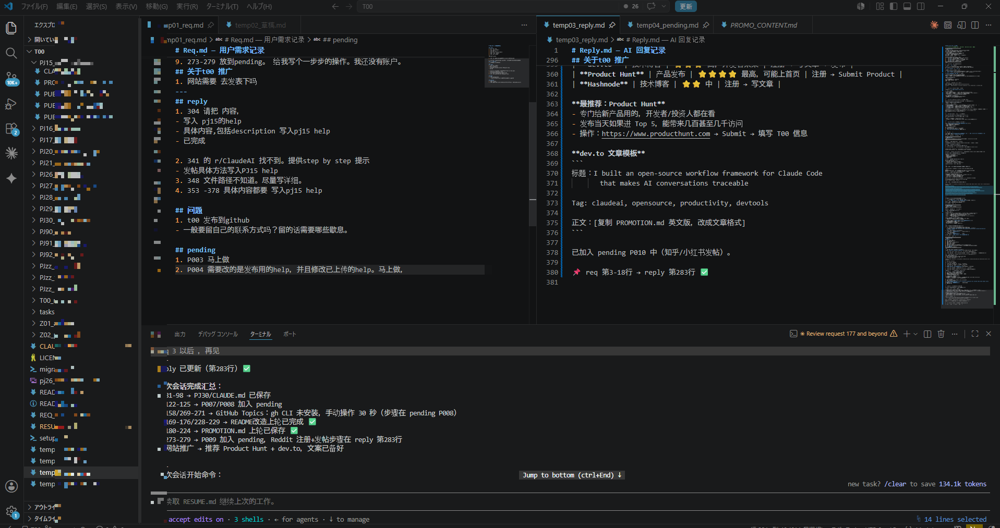

[](https://opensource.org/licenses/MIT)
[](https://claude.ai/claude-code)
[](https://github.com/maysunAI/T00/stargazers)

# AI00 — Claude Code AI 协作框架

> **再也不丢失 AI 对话上下文。每条回答可追溯，每次会话可接续。**

[English](README_en.md) · [帮助文档（45篇）](AI00_Common/_docs/help/H00_help_index.md) · [快速开始 →](#30-秒入门)

---

## 解决什么问题

你是否遇到过：

- 和 AI 聊了几十轮，回头想找某个结论 — **完全找不到**
- 开了新会话，AI 不知道你上次做了什么
- 每次都要重新解释背景，浪费时间

**AI00 用最简单的方式解决这个问题：需求写进固定文件，回答写进固定文件，每条都标行号。**

---

## 30 秒入门

**第 1 步：在 `temp01_req.md` 写需求**

```
1. 检查登录功能有没有 bug
2. 确认测试覆盖率
```

**第 2 步：告诉 AI 从哪行读**

```
req 1 以后
```

**第 3 步：AI 在 `temp03_reply.md` 整理后回答**

```
══════════════════════════════
❓ [2026-06-10 10:30]
原文：
[1] 检查登录功能有没有 bug
[2] 确认测试覆盖率

AI整理后的问题（mapping 原文）
1. (原文 [1]) 登录 bug 检查
2. (原文 [2]) 测试覆盖率现状
───────────────────────────────
1. (原文 [1]) 发现 session 过期问题 — 已在 auth.js:42 修复

2. (原文 [2]) 当前覆盖率 73%，建议优先补充登录模块。

📌 req 第 1-2 行 → reply 第 8 行 ✅
```

**效果**：`📌` 标记 + mapping 能追溯每条原始需求，再也不丢失。



---

## 适合哪些人

- 每天用 Claude Code 工作的开发者
- 独立开发者（想记住自己做了什么）
- 对 AI 会话上下文丢失感到头疼的人

---

## 特性对比

| 特性 | AI00 | 普通 CLAUDE.md | Cursor Rules |
|------|------|---------------|--------------|
| 行号可追溯 | ✅ 每条标行号 | ❌ | ❌ |
| 会话自动存档 | ✅ RESUME.md | ❌ | ❌ |
| 多项目管理 | ✅ PROJECTS_INDEX | ❌ | ❌ |
| 42篇帮助文档 | ✅ | ❌ | ❌ |
| Slash 命令（14个）| ✅ | 少 | 少 |
| 规则继承系统 | ✅ R01–R10 | 单文件 | 单文件 |
| 跨会话 AI 记忆 | ✅ | ❌ | ❌ |

---

## 关键触发词

| 说这句话 | AI 执行 |
|---------|---------|
| `req X行以后` | 从第 X 行读 req，回答写入 reply |
| `建项目 xxx` | 自动建文件夹 + 注册到 PROJECTS_INDEX |
| `草稿更新` | 读草稿 → 追加到 req → 回答 → 清空草稿 |
| `再见` | 自动存档 + 更新 RESUME.md，下次接着来 |

---

## 目录结构

```
T00/
├── CLAUDE.md                    ← 根规则（自动加载）
├── AI00_Common/
│   ├── CLAUDE.md                ← 通用规则（含沟通协议）
│   ├── rules/                   ← AI 行为规则（R01–R10）
│   ├── .claude/commands/        ← Slash 命令（/t00-*）
│   └── projects/PROJECTS_INDEX.md
├── temp01_req.md                ← 用户写需求
├── temp02_草稿.md               ← 草稿区
├── temp03_reply.md              ← AI 写回答
└── PJxx_项目名/                  ← 各项目文件夹
```

---

## 帮助文档

45 篇使用指南，覆盖从入门到高级的全部用法。

| 类别 | 文件 | 内容 |
|------|------|------|
| 入门必读 | H38_quick_start.md | 5分钟上手 |
| 工作流 | H02_req_reply_workflow.md | req→reply 完整流程 |
| 命令 | H28_slash_commands_guide.md | 全部 Slash 命令说明 |
| 发布 | H13_github_publish.md | GitHub 发布指南 |
| 速查 | H25_prompt_cheatsheet.md | 常用触发词汇总 |

**生成单文件 HTML**（手机可用）：

```powershell
.\AI00_Common\_docs\gen_help_html.ps1
```

---

## 上手步骤

1. Clone 本仓库
2. 用 Claude Code 打开（`claude` CLI 或 VS Code 扩展）
3. 在 `temp01_req.md` 写第一条需求
4. 对 AI 说：`req 1 以后`

无需安装任何依赖，无需配置文件，无需 API Key。

---

## 联系方式

有问题或建议？[提交 Issue](https://github.com/maysunAI/T00/issues)

GitHub：[@maysunAI](https://github.com/maysunAI)

---

## 开源协议

[MIT License](LICENSE) — 自由使用、修改、分发。

---

> ⭐ **如果 AI00 帮到了你，点个 Star 让更多人发现它。** ⭐
>
> [在 GitHub 上 Star →](https://github.com/maysunAI/T00)
